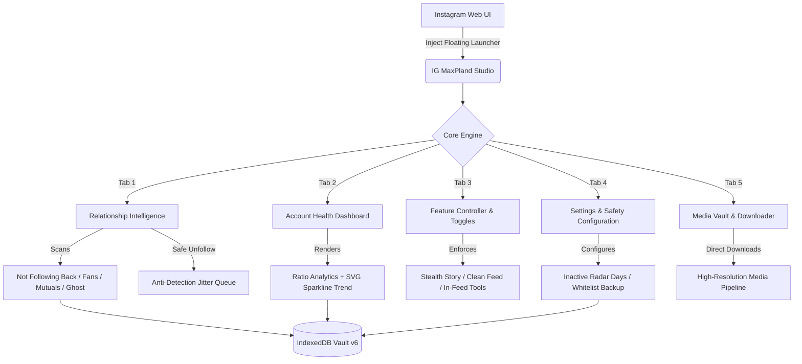

<div align="center">

  <h1>⚡ IG MaxPland <sub style="font-size: 14px; color: #38bdf8;">v2.6.0</sub></h1>
  <p><strong>The Definitive Relationship Intelligence Suite & Precision Media Downloader for Instagram Web</strong></p>
  <p><em>Engineered for raw speed, zero-footprint privacy, and stealth anti-detection. Pure Vanilla JavaScript · Zero Dependencies.</em></p>

  <p>
    <a href="#-one-click-installation"></a>
    <a href="https://github.com/Stxyu-p/ig-maxpland/releases"></a>
    <a href="LICENSE"></a>
  </p>

  <p>
    
    
    
    
    
  </p>

</div>

---

## 🌟 What makes IG MaxPland v2.6.0 Different?

Most Instagram browser extensions inject intrusive popups, harvest your session tokens to remote servers, or spam rapid queries that trigger Instagram account checkpoints and rate limits.

**IG MaxPland is built on five strict engineering principles:**
1. 🛡️ **100% Client-Side Private**: Zero external servers, zero analytics, and zero tracking. All processing happens entirely inside your browser.
2. 👁️ **Stealth Story Viewing**: Intercepts Instagram seen beacons at the network transport layer with native function masking. Watch stories with zero telemetry footprint.
3. 🧹 **Clean Feed Mode (No Scroll Bounce)**: Strips sponsored ads and suggested clutter from your feed using zero-height layout preservation and `overflow-anchor: none` to keep scrolling 100% buttery smooth.
4. ⏱️ **Inactive Following Radar**: Scans your following list to detect dormant accounts that haven't posted in 3, 6, 12, or 24 months, complete with batch safety limits (20 users/batch).
5. 📊 **Account Health Dashboard**: Evaluates your account structure, mutual ratio, follower-to-following balance, and historical growth with embedded SVG sparklines.

---

## 🚀 Highlight Features at a Glance

```
┌────────────────────────────────────────────────────────────────────────────────────────┐
│                                 ⚡ IG MAXPLAND STUDIO                                  │
├──────────────────────────┬──────────────────────────┬──────────────────────────────────┤
│ 👁️ Stealth Story Viewer │ 🧹 Clean Feed Mode       │ ⏱️ Inactive Following Radar     │
│ Watch stories 100%       │ Zero ads, zero sponsored │ Detect accounts dormant for      │
│ anonymously without      │ posts, zero scroll-jump  │ 3-24 months with safe batching   │
│ triggering seen beacons  │ layout collapse          │                                  │
├──────────────────────────┼──────────────────────────┼──────────────────────────────────┤
│ 📊 Account Health Audit  │ 📥 Precision Downloader  │ 🛡️ Anti-Detection Hardening    │
│ Real-time mutual ratios, │ In-feed HD downloads for │ Native header parity, jitter     │
│ ghost impact, and growth │ photos, videos, stories, │ delays, and zero bot signatures  │
│ history sparklines       │ carousels & full avatars │                                  │
└──────────────────────────┴──────────────────────────┴──────────────────────────────────┘
```

---

## 📊 Feature Comparison

| Capability | Generic Scrapers | Common IG Extensions | ⚡ **IG MaxPland v2.6.0** |
| :--- | :---: | :---: | :---: |
| **Privacy & Security** | ❌ Sends data to third parties | ⚠️ Requires full tab access | ✅ **100% Local (Zero Analytics)** |
| **Login Credential Safety** | ❌ Prompts for password | ⚠️ Session hijacking risk | ✅ **Zero Credentials Asked (Session Native)** |
| **Stealth Story Mode** | ❌ Not available | ⚠️ Leaks seen beacons | ✅ **100% Intercepted + Masked Function** |
| **Feed Clean Mode** | ❌ None | ⚠️ Freezes/crashes page | ✅ **Zero-Height Layout & No Scroll Bounce** |
| **Inactive Account Radar** | ❌ None | ❌ None | ✅ **Safe 20/batch Deep Post Timestamps** |
| **Account Health Analytics**| ❌ None | ⚠️ Cloud-based subscription | ✅ **Local Snapshot Diff & SVG Sparklines** |
| **Follower Tracking** | ❌ None | ⚠️ Shallow diffing | ✅ **IndexedDB Historical Snapshot Diff** |
| **Unfollow Protection** | ❌ None | ❌ None | ✅ **Protected Whitelist + JSON Backup** |
| **Unfollow Safety Pacing** | ❌ Rapid spam (Ban risk) | ❌ Automated spamming | ✅ **3,000–5,000ms Randomized Jitter** |
| **Media Downloads** | ⚠️ Low-res or watermarked | ⚠️ Heavy memory-leaking ZIP | ✅ **Direct 1-Click Stream to Disk** |
| **External Dependencies** | ❌ Heavy (jQuery/Lodash) | ❌ Bloated runtime | ✅ **Zero (`@require` is unused)** |

---

## 🧩 Architectural Overview



---

## 🛠️ Deep-Dive Feature Breakdown

<details open>
<summary><h3>👁️ 01 · Stealth Story Viewer (100% Anonymous Mode)</h3></summary>

> **Watch any story without leaving a trace.** Intercepts and terminates Instagram's seen telemetry beacons at the transport layer while keeping video/photo playback seamless.

```
[ Your Browser ] ───▶ [ Active Story View ]
                            │
                            ▼ (Attempts to send Seen Beacon)
                     ┌────────────────────────────────────────┐
                     │ 🛑 IG MaxPland Stealth Interceptor     │ ──▶ [ Drops Request ]
                     │  - Intercepts /api/v1/stories/reel/seen│ ──▶ [ Mocks 200 OK ]
                     │  - Blocks GraphQL StoryView mutations  │
                     └────────────────────────────────────────┘
                            │
                            ▼
             [ 👻 You Never Appear in the Viewer List ]
```

| Dimension | Technical Implementation | Safety & Stealth Advantage |
| :--- | :--- | :--- |
| **Telemetry Interception** | Hooks global `fetch` to drop `/api/v1/stories/reel/seen` and GraphQL seen mutations | Zero seen receipts transmitted to Meta servers |
| **Native Anti-Detection** | `Function.prototype.toString` camouflage returns `function fetch() { [native code] }` | Bypasses Instagram automated bot detection scripts |
| **Window Hygiene** | State stored via `Symbol.for('mp_seen_hooked')` instead of exposed `window` properties | Invisible to third-party DOM / global variable scanners |
| **One-Click Control** | Floating toggle button injected on active stories (`👁️ Stealth: ON / OFF`) | Seamless on-the-fly toggling with real-time visual feedback |

</details>

<br>

<details open>
<summary><h3>🧹 02 · Clean Feed Mode (Zero-Bounce Layout Shield)</h3></summary>

> **A clutter-free home feed with zero scroll jumping.** Strips sponsored ads and algorithmic suggestions while preserving Instagram's React virtual DOM integrity.

```
[ Instagram Home Feed ] ───▶ [ Incoming Post Chunk ]
                                   │
                    Is Post "Sponsored" or "Suggested"?
                                ╱     ╲
                            YES        NO
                            ╱            ╲
    ┌──────────────────────────────┐     ┌──────────────────────┐
    │ 🛡️ Apply Zero-Height Layout  │     │  Render Normal Post  │
    │  - visibility: hidden        │     └──────────────────────┘
    │  - height: 0 !important      │
    │  - overflow-anchor: none ⚡  │ ──▶ [ Continuous, Smooth 60fps Scrolling ]
    └──────────────────────────────┘     [ Zero Bouncing back to Top (0, 0)   ]
```

| Engineering Pillar | Mechanism | User Impact |
| :--- | :--- | :--- |
| **Zero-Height Preservation** | Uses `visibility: hidden; height: 0;` instead of disruptive `display: none` | Keeps React fiber node references intact without DOM collapse |
| **Scroll-Anchor Lock** | Enforces `overflow-anchor: none !important;` on filtered articles | Prevents Chromium scroll engine from resetting `scrollTop` to 0 |
| **Header-Targeted Scan** | Inspects exclusively the `<header>` element or first 300 characters | Blazing fast filter execution without re-rendering post trees |
| **Precise Keyword Filter** | Strictly targets `sponsored`, `ได้รับการสนับสนุน`, `suggested for you`, `แนะนำสำหรับคุณ` | Protects normal posts from followed friends from being hidden |

</details>

<br>

<details open>
<summary><h3>⏱️ 03 · Inactive Following Radar (Ghost & Dormant Hunter)</h3></summary>

> **Prune abandoned accounts safely.** Detects profiles in your Following list that have stopped posting for months or years, backed by automated rate-limit pacing.

```
[ Following List ] ──▶ [ Read IndexedDB Activity Cache ]
                             │
                      Cached timestamp exists?
                          ╱          ╲
                      YES              NO
                      ╱                  ╲
        [ Use Cached Date ]      [ Query User's Latest Post ]
                                         │
                                  ┌──────────────┴──────────────┐
                                  │ 🛡️ Safety Batch Guard       │
                                  │  - Max 20 new users / batch │
                                  │  - 3.5s - 6.0s jitter pause │
                                  └─────────────────────────────┘
```

| Feature Aspect | Specification |
| :--- | :--- |
| **Configurable Inactivity Window** | 🎛️ Choose threshold: **90 Days** (3 mo), **180 Days** (6 mo), **365 Days** (1 yr), or **730 Days** (2 yr) |
| **Batch Safety Ceiling** | 🛑 Enforces `BATCH_SAFETY_LIMIT = 20` fresh queries per session to respect Meta rate limits |
| **Anti-Detection Jitter** | ⏱️ Randomized humanized pauses (3,500ms – 6,000ms) between profile requests |
| **Persistent IndexedDB Cache** | 💾 Saves verified last-post timestamps locally; subsequent scans run instantaneously |

</details>

<br>

<details open>
<summary><h3>📊 04 · Account Health Dashboard & Trend Analytics</h3></summary>

> **Complete relationship intelligence at a single glance.** High-precision balance metrics computed 100% locally from historical snapshots.

```
┌────────────────────────────────────────────────────────────────────────────────────────┐
│                        📈 ACCOUNT HEALTH & GROWTH INTELLIGENCE                         │
├──────────────────────────┬──────────────────────────┬──────────────────────────────────┤
│ ⚖️ Follower Ratio        │ 🤝 Mutual Friendship     │ 👻 Ghost Impact                  │
│ Follower vs Following    │ Reciprocal follow rate   │ Accounts with no avatar +        │
│ balance & classification │ across your network      │ dormant profiles detected        │
├──────────────────────────┴──────────────────────────┴──────────────────────────────────┤
│ 📈 Historical Growth Sparkline (SVG Vector)                                            │
│   · Plotted from IndexedDB snapshots across scans (Zero external libraries)            │
│   · Real-time delta tracker (+/- followers since previous snapshot)                    │
├────────────────────────────────────────────────────────────────────────────────────────┤
│ 💡 Strategic Account Advice                                                            │
│   · Instant actionable recommendations based on your current network ratios            │
└────────────────────────────────────────────────────────────────────────────────────────┘
```

| Metric / Tool | Diagnostic Meaning |
| :--- | :--- |
| **Follower / Following Ratio** | Categorizes account status: **⭐ Influencer/Creator**, **⚖️ Healthy Balance**, or **🔍 Consumer Heavy** |
| **Mutual Friendship Rate** | Quantifies true relationship engagement (Mutuals / Total Following) |
| **Unrequited Outbound** | Highlights total accounts you follow who refuse to follow you back |
| **Native SVG Sparkline** | Vector curve generated on-the-fly inside the DOM without third-party chart dependencies |

</details>

<br>

<details open>
<summary><h3>🔍 05 · Relationship Scanner & Safe Batch Unfollower</h3></summary>

> **Deep categorization and human-mimicking unfollow queue.** Keep your network clean with zero risk of account checkpoint flags.

| Category Filter | Description | Safety Action |
| :--- | :--- | :---: |
| **Not Following Back** | Accounts you follow that do not follow you back | Batch Unfollow Available |
| **Fans** | Accounts following you that you do not follow back | View / Whitelist |
| **Mutuals** | Reciprocal mutual friends | Protected by default |
| **Recently Lost** | Unfollowers detected by diffing against your IndexedDB snapshot | Alerts & Historical Tracking |
| **Ghost Accounts** | Suspected bots (default system avatar, zero posts) | Safe Cleanup |
| **Inactive Radar** | Accounts dormant beyond your configured threshold | One-Click Selection |

> [!TIP]
> **🛡️ Defensive Unfollow Safeguard:**
> - **Starred Whitelist**: Mark friends or creators with a star (⭐) to permanently lock them from accidental bulk unfollows.
> - **JSON Backup / Restore**: Export your Whitelist configuration as a `.json` file to migrate your settings between devices effortlessly.
> - **Randomized 3–5s Jitter**: Emulates real human clicking behavior with live countdown timers and instant abort controls.

</details>

<br>

<details open>
<summary><h3>📥 06 · Precision Media Downloader & Vault</h3></summary>

> **Original quality without compromise.** Direct-to-disk streaming for single photos, progressive 1080p MP4 videos, full multi-slide carousels, and stories.

```
[ Instagram Media ] ──▶ [ MaxPland Native Action Bar ]
                               │
            ┌──────────────────┼──────────────────┐
            ▼                  ▼                  ▼
     [ Single Media ]   [ Multi Carousel ]  [ Story & Avatar ]
     · HD Photo (.jpg)  · All slides (1-10) · Uncompressed MP4
     · 1080p MP4 Video  · Original streams  · HD Profile Avatar
            │                  │                  │
            └──────────────────┴──────────────────┘
                               │
                               ▼
        [ Streamed Directly to Disk via GM_download ]
        (Zero Memory Bloat · Zero In-Browser ZIP Freezes)
```

| Feature Target | Capability & Details |
| :--- | :--- |
| **In-Feed Action Menu** | Sleek dark-glass menu injected next to the bookmark button on every feed post |
| **1-Click Rapid Download** | Double-click the download icon to immediately grab the active media at max resolution |
| **Full Carousel Batching** | Downloads every image and video slide in a multi-post with proper sequential naming |
| **Story Toolbar & Cover** | Floating utility bar on stories to download full video clips, cover art, or open in new tab |
| **HD Profile Avatar** | Dedicated avatar badge on profile pages to download full uncompressed profile photos |
| **Local Media Vault** | IndexedDB record of all downloaded assets with direct re-download and inspect links |

</details>

---

## 💻 One-Click Installation

### Step 1: Install a Userscript Manager
Make sure you have an active userscript manager installed in your browser:
* [**Tampermonkey**](https://www.tampermonkey.net/) *(Recommended)*
* [**Violentmonkey**](https://violentmonkey.github.io/)

### Step 2: Choose Your Language Build (v2.6.0)

| Edition | Language | Target Audience | Direct Installation Link |
| :--- | :--- | :--- | :--- |
| 🌐 **Global Release** | English | Worldwide users | [**👉 Install IG MaxPland (v2.6.0 EN)**](https://raw.githubusercontent.com/Stxyu-p/ig-maxpland/main/ig_maxpland_en.user.js) |
| 🇹🇭 **Thai Native Edition** | ภาษาไทย | ผู้ใช้ภาษาไทย | [**👉 ติดตั้ง IG MaxPland (v2.6.0 TH)**](https://raw.githubusercontent.com/Stxyu-p/ig-maxpland/main/ig_maxpland.user.js) |

### Step 3: Start Using
Open [Instagram Web](https://www.instagram.com/) and look for the glowing **MaxPland floating icon** at the bottom-right of your screen!

---

## ⌨️ Shortcuts & Hotkeys

| Trigger / Shortcut | Action | Description |
| :--- | :--- | :--- |
| <kbd>Alt</kbd> + <kbd>Shift</kbd> + <kbd>M</kbd> | **Toggle Studio** | Open or close the MaxPland Control Center modal |
| **Floating Circle** | **Click / Drag** | Click to open Studio, or click-and-drag to reposition anywhere |
| **Double-Click Download Button** | **Direct Download** | Instantly downloads the active in-feed media at max resolution |
| **Single-Click Download Button** | **Precision Menu** | Opens download options (HD Image/Video, All Carousel, Open in Tab) |
| **Story Stealth Button** | **Toggle Stealth** | Toggle anonymous story viewing directly on the story screen |

---

## 🔒 Security & Defensive Guard Manifesto

> [!IMPORTANT]
> **No Credentials Stored. No Analytics. Zero External Network Requests.**

1. **Native Session Transport**: IG MaxPland never asks for your password. It authenticates solely through your browser's existing Instagram session cookies (`ds_user_id` and `csrftoken`).
2. **Meta Header Parity**: Requests include legitimate Meta web headers (`X-ASBD-ID: 129477`, dynamic `X-IG-WWW-Claim`), and exclude obsolete bot signatures such as `X-Requested-With: XMLHttpRequest`.
3. **Local IndexedDB Database**: All relationship snapshots, whitelist configurations, and activity cache reside exclusively on your machine in `IG_MAXPLAND_VAULT`.
4. **Zero `@require` CDNs**: Free of third-party script vulnerabilities. All code is completely self-contained in one file.

---

## ❓ Frequently Asked Questions (FAQ)

<details>
<summary><b>Q: How does Stealth Story Viewer keep me anonymous?</b></summary>
<br>
When you view a story on Instagram, the browser transmits a "seen" beacon request to Meta's servers. IG MaxPland intercepts and drops these requests before they leave your browser, while returning a mocked 200 OK response to Instagram's frontend so playback is uninterrupted and your account name never appears on the viewer list.
</details>

<details>
<summary><b>Q: Why does Clean Feed Mode not jump back to the top?</b></summary>
<br>
Standard ad blockers use <code>display: none</code>, which collapses elements to 0x0 pixels and disrupts Chromium's scroll-anchoring algorithm. IG MaxPland uses zero-height layout preservation combined with <code>overflow-anchor: none !important;</code>, ensuring the scroll engine maintains the exact viewport position without bouncing.
</details>

<details>
<summary><b>Q: What are the safe limits for bulk unfollowing?</b></summary>
<br>
We recommend limiting bulk unfollows to 50–100 accounts per session, with at least several hours between batches. IG MaxPland enforces a randomized 3–5 second human-mimicking pause between each request to protect your account.
</details>

<details>
<summary><b>Q: Can I transfer my Starred Whitelist between devices?</b></summary>
<br>
Yes! Go to the <b>Settings</b> tab in MaxPland Studio and click <b>Backup Whitelist</b> to download a JSON file. On your other device or browser, click <b>Restore Whitelist</b> to import it instantly.
</details>

---

## 📄 License

This project is licensed under the **MIT License** - see the [LICENSE](LICENSE) file for details.

```
Copyright (c) 2026 P Choke & SORA
```
Feel free to star ⭐ the repository, report issues, and suggest enhancements!
