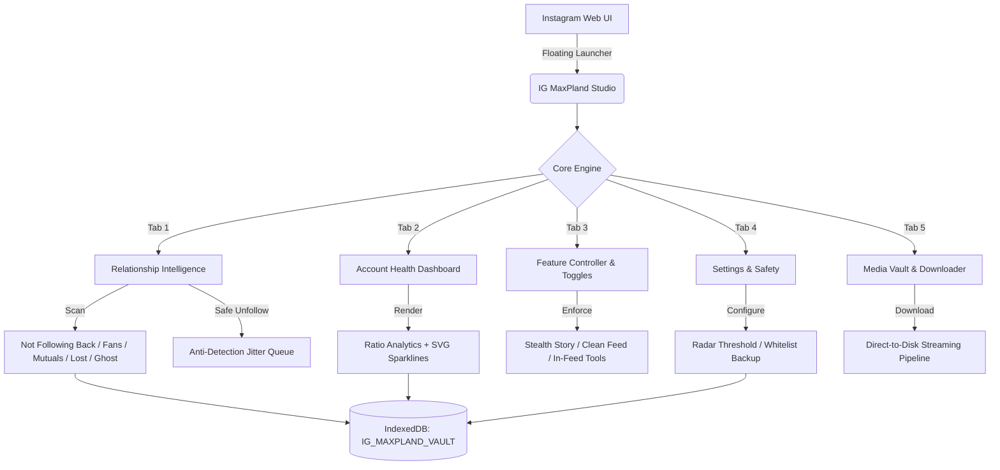
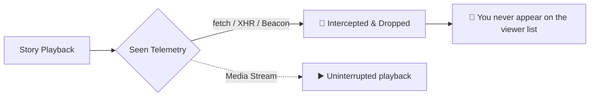

<div align="center">

# ⚡ IG MaxPland <sub>v3.0.0</sub>

**Enterprise-Grade Relationship Intelligence & Precision Media Downloader for Instagram Web**

*Clean Architecture · High Speed · Zero-Footprint Privacy · Stealth Anti-Detection*  
*Pure Vanilla JavaScript · Zero Dependencies · Modular Source & Automated Build Pipeline*

[](https://greasyfork.org/th/scripts/595787-ig-maxpland)
[](#-one-click-installation)
[](https://github.com/Stxyu-p/ig-maxpland/releases)
[](LICENSE)


</div>

---

## 🚀 Quick Install

| Channel | Edition | Source | Link |
| :--- | :--- | :--- | :--- |
| 🦊 **Greasy Fork** | Official Distribution | Auto-updating | [**👉 Install from Greasy Fork**](https://greasyfork.org/th/scripts/595787-ig-maxpland) |
| 🇹🇭 **Userscript (TH)** | Thai Native Edition (v3.0.0) | Direct GitHub Raw | [**👉 Install ig_maxpland.user.js**](https://raw.githubusercontent.com/Stxyu-p/ig-maxpland/main/ig_maxpland.user.js) |
| 🌐 **Userscript (EN)** | Global English Edition | Direct GitHub Raw | [**👉 Install ig_maxpland_en.user.js**](https://raw.githubusercontent.com/Stxyu-p/ig-maxpland/main/ig_maxpland_en.user.js) |

*Requires a userscript manager such as [Tampermonkey](https://www.tampermonkey.net/) (recommended) or [Violentmonkey](https://violentmonkey.github.io/).*

---

## 🌟 Core Philosophy

Most Instagram extensions inject telemetry, transmit session cookies to third-party servers, or execute aggressive request bursts that trigger Meta account checkpoints.

IG MaxPland operates under five strict engineering constraints:

| Principle | Technical Implementation | Practical Benefit |
| :--- | :--- | :--- |
| 🛡️ **100% Client-Side Execution** | Zero telemetry, zero cloud endpoints, zero analytics | Complete privacy; session data never leaves your browser |
| 👁️ **Stealth Story Interception** | Multi-channel network hook (`fetch`, `XHR`, `sendBeacon`) | View any story anonymously without sending *seen* receipts |
| 🧹 **Clean Feed Engine** | Zero-height preservation with `overflow-anchor: none` | Strips ads and suggested content without triggering scroll bounce |
| ⏱️ **Inactive Follower Radar** | Bounded batch scanning (max 20 fresh profiles/batch) | Identifies dormant accounts safely within Meta rate limits |
| 📊 **Offline Relationship Analytics** | Embedded IndexedDB snapshot engine + native SVG sparklines | Comprehensive follow balance and mutual ratio auditing |

---

## 🆕 What's New in v3.0.0 (Clean Architecture)

- **🏗️ Full Clean Architecture Modularization:**
  - Transitioned the codebase into 18 decoupled, single-responsibility modules across `src/modules/`, `src/core/`, `src/features/`, `src/ui/`, and `src/utils/`.
  - Leaf authentication (`IgAuth`), isolated transport (`IgTransport`), diffing engine (`IgRelationship`), media processing (`IgMedia`), profile fetching (`IgProfile`), and safe unfollowing (`IgUnfollow`).
- **📦 Zero-Dependency Build Pipeline (`build.js`):**
  - Deterministic module concatenation in topological dependency order.
  - Generates distribution bundle at `dist/ig_maxpland.user.js` and synchronizes root `ig_maxpland.user.js`.
  - Full developer workflow: `npm run build`, `npm run dev` (with `--watch`), and `npm test`.
- **🛡️ Enhanced Safety Hardening (P0):**
  - Account ID validation hoisted outside of retry loops in `IgBridge.request()`, `downloadResolvedMedia()`, and `runInactiveScan()`.
  - Automatic snapshot migration fallback for pre-v6 historical lost-followers records.
  - Strengthened cookie refresh hints for CSRF token expiration during unfollow operations.
  - Network retry mechanism (2× exponential backoff) for media shortcode downloads.
- **🔒 Reduced Attack Surface:**
  - Stripped unused `@grant GM_xmlhttpRequest` and `@connect fbcdn.net` permissions from userscript headers.
- **🧪 100% Automated Test Coverage:**
  - Modular unit tests (`test/phase1` through `test/phase5`) covering all extracted modules.
  - Zero-regression certification against the 46-invariant test suite (`round1.check.cjs`).

---

## 📊 Feature Comparison

| Capability | Generic Web Scrapers | Common IG Extensions | ⚡ **IG MaxPland** |
| :--- | :---: | :---: | :---: |
| **Data Privacy** | ❌ Transmits to external servers | ⚠️ Over-permissioned tab access | ✅ **100% Local (Zero Analytics)** |
| **Credential Safety** | ❌ Prompts for username/password | ⚠️ Session token capture | ✅ **Zero Credentials (Session-Native)** |
| **Stealth Story Mode** | ❌ Not supported | ⚠️ Frequently leaks seen beacons | ✅ **Multi-Channel Transport Interceptor** |
| **Feed Clean Mode** | ❌ None | ⚠️ Freezes viewport or breaks layout | ✅ **Zero-Height Layout & Anchor Locking** |
| **Inactive Account Radar** | ❌ None | ❌ None | ✅ **Safe 20/batch Deep Post Timestamps** |
| **Account Health Dashboard** | ❌ None | ⚠️ Paid cloud subscription | ✅ **Local Snapshot Diff & SVG Sparklines** |
| **Unfollow Protection** | ❌ None | ❌ None | ✅ **Starred Whitelist + JSON Portability** |
| **Anti-Detection Pacing** | ❌ Fixed rapid spam (high ban risk) | ❌ Automated loop | ✅ **4,500–7,500ms Randomized Jitter** |
| **In-Feed Media Downloader** | ⚠️ Watermarked or downscaled | ⚠️ Heavy memory-leaking ZIPs | ✅ **Direct 1-Click Stream to Disk** |
| **External Dependencies** | ❌ jQuery, Lodash, external CDNs | ❌ Multi-megabyte bundles | ✅ **Zero Dependencies (Pure Vanilla JS)** |

---

## 🧩 Architectural Flow



---

## 🛠️ Feature Deep Dive

### 👁️ 01 · Stealth Story Viewer (Ghost Mode)

Watch Instagram stories anonymously. Telemetry beacons indicating you have seen a story are intercepted and dropped before exiting your machine, while media playback continues without disruption.



- **Multi-Transport Dropper:** Intercepts `/api/v1/stories/reel/seen/`, GraphQL `StoriesSeen` mutations, and `navigator.sendBeacon`.
- **Native Camouflage:** Functions preserve native string representation (`[native code]`) to evade page-side hook detection.
- **Dedicated Story Bar:** A clean floating toolbar on active stories provides instant `👁️ Stealth: ON / OFF` toggling.

---

### 🧹 02 · Clean Feed Mode

Removes sponsored advertisements and suggested accounts from the home feed with zero layout shift.

- **Zero-Height Preservation:** Hides articles with `visibility: hidden; height: 0` instead of `display: none`, keeping React Fiber references and DOM node heights stable.
- **Scroll-Anchor Protection:** Applies `overflow-anchor: none !important` to filtered posts, ensuring Chromium never resets your scroll position back to top.
- **Micro-Targeted Evaluation:** Scans only the article header (first 300 characters) for sponsorship tokens, bypassing expensive DOM tree re-renders.

---

### ⏱️ 03 · Inactive Following Radar

Audits your following list for dormant accounts that have stopped publishing new content.

- **Configurable Inactivity Window:** Select from **90 days** (3 months), **180 days** (6 months), **365 days** (1 year), or **730 days** (2 years).
- **Batch Safety Ceiling:** Hard cap of **20 fresh profile queries per batch** to strictly honor Meta rate limits.
- **Randomized Jitter:** Enforces 3,500–6,000ms delay between profile evaluations.
- **Local Persistence:** Verified post timestamps are stored in IndexedDB so repeat audits complete instantly.

---

### 🔍 04 · Relationship Intelligence & Safe Unfollower

Comprehensive audit of reciprocal relationships with defensive unfollowing protections.

| Relationship Category | Description | Primary Action |
| :--- | :--- | :---: |
| **Not Following Back** | Accounts you follow who do not follow you back | Safe Batch Unfollow |
| **Fans** | Accounts following you whom you do not follow back | Inspect / Whitelist |
| **Mutual Friends** | Reciprocal contacts | Protected by default |
| **Recently Lost** | Unfollowers detected between historical snapshots | Historical Diff Log |
| **Ghost Accounts** | Followers with no avatar picture | Safe Segmentation |
| **Inactive Radar** | Accounts exceeding your dormancy threshold | Filtered Selection |

#### 🛡️ Unfollow Safety Safeguards
- **Starred Whitelist (⭐):** Lock friends or creators to permanently prevent accidental unfollows across all interfaces.
- **Humanized Jitter Pacing:** Enforces randomized 4,500–7,500ms intervals between calls with visible countdown.
- **Server Confirmation Enforcement:** Unfollow actions are committed only after verified HTTP 200 responses; ambiguous failures immediately abort the queue.
- **JSON Portability:** Export and import your whitelist configuration across browsers and machines.

---

### 📥 05 · Precision In-Feed Downloader & Media Vault

Stream high-resolution assets directly to disk without quality degradation.

- **In-Feed Action Bar:** Dark-themed action triggers embedded directly next to the bookmark button on posts.
- **1-Click Direct Download:** Double-click the download icon to grab the active media asset immediately.
- **Full Carousel Processing:** Sequential multi-slide downloader with automatic deduplication.
- **Full-Resolution Profile Avatars:** Dedicated profile header badge extracts uncompressed HD avatars.
- **Local Media Vault:** IndexedDB record of download history with one-click redownload links.

---

## ⌨️ Shortcuts & Interaction

| Trigger | Context | Action |
| :--- | :--- | :--- |
| <kbd>Alt</kbd> + <kbd>Shift</kbd> + <kbd>M</kbd> | Global | Open or close MaxPland Studio |
| **Floating Indicator** | Global | Click to open Studio, drag to reposition |
| **Double-Click Media Button** | Feed Post | Instantly stream active image/video to disk |
| **Single-Click Media Button** | Feed Post | Open media options menu (HD, Carousel, New Tab) |
| **Story Toolbar Toggle** | Active Story | Toggle Stealth Ghost Mode on or off |

---

## 🔒 Security & Privacy Standard

> [!IMPORTANT]
> **Zero Third-Party Communication · Zero Credentials Required**

1. **Session-Native Transport:** Runs entirely within your authenticated browser session — never requests or stores login credentials.
2. **Meta Header Parity:** Sends genuine browser headers (`X-ASBD-ID`, dynamic `X-IG-WWW-Claim`) without legacy scraping signatures.
3. **Local Storage Only:** Relationship snapshots, settings, and media logs reside solely in client-side IndexedDB (`IG_MAXPLAND_VAULT`).
4. **Zero CDN Inclusions:** Self-contained script with zero `@require` dependencies eliminates supply-chain vulnerabilities.

---

## 🏗️ Clean Architecture & Project Structure

```
ig-maxpland/
├── src/
│   ├── core/                  # State management & faceted filter engine
│   │   ├── StateManager.js
│   │   └── FilterEngine.js
│   ├── modules/               # Domain API & Relationship modules
│   │   ├── IgAuth.js          # Leaf authentication & session handling
│   │   ├── IgTransport.js     # Rate-limited HTTP transport
│   │   ├── IgRelationship.js  # Diffing & ghost detection
│   │   ├── IgMedia.js         # Media resolution & download helpers
│   │   ├── IgProfile.js       # Profile HD & activity fetching
│   │   └── IgUnfollow.js      # Defensive unfollowing execution
│   ├── features/              # User-facing standalone features
│   │   ├── MediaDownloader.js # In-feed & carousel downloader
│   │   ├── DOMInjector.js     # Action bars, avatar badges & observers
│   │   ├── StoryStealth.js    # Multi-channel seen interceptor
│   │   └── CleanFeed.js       # Non-collapsing feed cleaner
│   ├── ui/                    # UI engines & event systems
│   │   ├── EventDelegator.js  # Root event delegation
│   │   ├── ProgressController.js
│   │   └── TemplateEngine.js  # Safe XSS template interpolation
│   ├── utils/                 # Pure utility & DOM selector helpers
│   │   ├── Utils.js
│   │   ├── IGSelectors.js
│   │   └── DOMUtils.js
│   └── app.js                 # Application runtime & UI glue
├── dist/
│   └── ig_maxpland.user.js    # Production bundle (v3.0.0)
├── test/                      # Unit check suites (Phase 1 to Phase 5)
├── build.js                   # Zero-dependency build pipeline
├── round1.check.cjs           # 46-invariant regression test suite
└── package.json
```

---

## 🧪 Verification & Automated Testing

All tests run in an isolated Node.js test harness without external test runner dependencies:

```bash
# Run complete test suite (modules + production bundle)
npm test

# Run modular unit tests only
npm run test:modules

# Run full 46-invariant regression check on bundle
npm run test:bundle

# Development mode (watch and rebuild on file change)
npm run dev

# Production build
npm run build
```

**Verification Status:** **100% Pass** across all 5 modular test suites and **46/46 invariant checks passing** on the production bundle.

---

## 📄 License

Distributed under the [MIT License](LICENSE).  
Copyright (c) 2026 P Choke & SORA.

