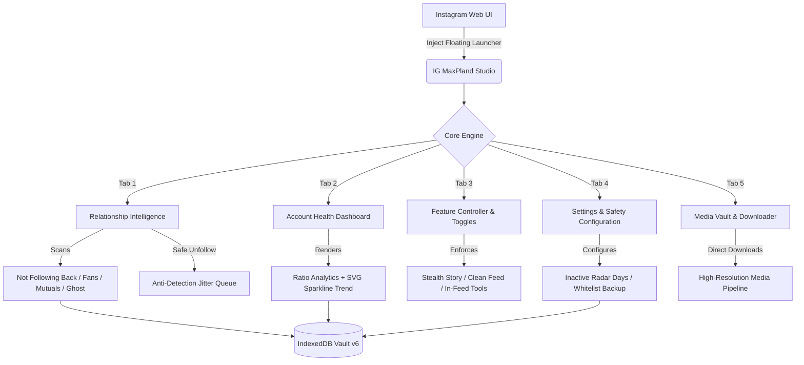

<div align="center">

  <h1>⚡ IG MaxPland <sub style="font-size: 14px; color: #38bdf8;">v2.6.0</sub></h1>
  <p><strong>The Definitive Relationship Intelligence Suite & Precision Media Downloader for Instagram Web</strong></p>
  <p><em>Engineered for raw speed, zero-footprint privacy, and stealth anti-detection. Pure Vanilla JavaScript · Zero Dependencies.</em></p>

  <p>
    <a href="#-one-click-installation"></a>
    <a href="https://github.com/Stxyu-p/ig-maxpland/releases"></a>
    <a href="LICENSE"></a>
  </p>

  <p>
    
    
    
    
    
  </p>

</div>

---

## 🌟 What makes IG MaxPland v2.6.0 Different?

Most Instagram browser extensions inject intrusive popups, harvest your session tokens to remote servers, or spam rapid queries that trigger Instagram account checkpoints and rate limits.

**IG MaxPland is built on five strict engineering principles:**
1. 🛡️ **100% Client-Side Private**: Zero external servers, zero analytics, and zero tracking. All processing happens entirely inside your browser.
2. 👁️ **Stealth Story Viewing**: Intercepts Instagram seen beacons at the network transport layer with native function masking. Watch stories with zero telemetry footprint.
3. 🧹 **Clean Feed Mode (No Scroll Bounce)**: Strips sponsored ads and suggested clutter from your feed using zero-height layout preservation and `overflow-anchor: none` to keep scrolling 100% buttery smooth.
4. ⏱️ **Inactive Following Radar**: Scans your following list to detect dormant accounts that haven't posted in 3, 6, 12, or 24 months, complete with batch safety limits (20 users/batch).
5. 📊 **Account Health Dashboard**: Evaluates your account structure, mutual ratio, follower-to-following balance, and historical growth with embedded SVG sparklines.

---

## 🚀 Highlight Features at a Glance

```
┌────────────────────────────────────────────────────────────────────────────────────────┐
│                                 ⚡ IG MAXPLAND STUDIO                                  │
├──────────────────────────┬──────────────────────────┬──────────────────────────────────┤
│ 👁️ Stealth Story Viewer │ 🧹 Clean Feed Mode       │ ⏱️ Inactive Following Radar     │
│ Watch stories 100%       │ Zero ads, zero sponsored │ Detect accounts dormant for      │
│ anonymously without      │ posts, zero scroll-jump  │ 3-24 months with safe batching   │
│ triggering seen beacons  │ layout collapse          │                                  │
├──────────────────────────┼──────────────────────────┼──────────────────────────────────┤
│ 📊 Account Health Audit  │ 📥 Precision Downloader  │ 🛡️ Anti-Detection Hardening      │
│ Real-time mutual ratios, │ In-feed HD downloads for │ Native header parity, jitter     │
│ ghost impact, and growth │ photos, videos, stories, │ delays, and zero bot signatures  │
│ history sparklines       │ carousels & full avatars │                                  │
└──────────────────────────┴──────────────────────────┴──────────────────────────────────┘
```

---

## 📊 Feature Comparison

| Capability | Generic Scrapers | Common IG Extensions | ⚡ **IG MaxPland v2.6.0** |
| :--- | :---: | :---: | :---: |
| **Privacy & Security** | ❌ Sends data to third parties | ⚠️ Requires full tab access | ✅ **100% Local (Zero Analytics)** |
| **Login Credential Safety** | ❌ Prompts for password | ⚠️ Session hijacking risk | ✅ **Zero Credentials Asked (Session Native)** |
| **Stealth Story Mode** | ❌ Not available | ⚠️ Leaks seen beacons | ✅ **100% Intercepted + Masked Function** |
| **Feed Clean Mode** | ❌ None | ⚠️ Freezes/crashes page | ✅ **Zero-Height Layout & No Scroll Bounce** |
| **Inactive Account Radar** | ❌ None | ❌ None | ✅ **Safe 20/batch Deep Post Timestamps** |
| **Account Health Analytics**| ❌ None | ⚠️ Cloud-based subscription | ✅ **Local Snapshot Diff & SVG Sparklines** |
| **Follower Tracking** | ❌ None | ⚠️ Shallow diffing | ✅ **IndexedDB Historical Snapshot Diff** |
| **Unfollow Protection** | ❌ None | ❌ None | ✅ **Protected Whitelist + JSON Backup** |
| **Unfollow Safety Pacing** | ❌ Rapid spam (Ban risk) | ❌ Automated spamming | ✅ **3,000–5,000ms Randomized Jitter** |
| **Media Downloads** | ⚠️ Low-res or watermarked | ⚠️ Heavy memory-leaking ZIP | ✅ **Direct 1-Click Stream to Disk** |
| **External Dependencies** | ❌ Heavy (jQuery/Lodash) | ❌ Bloated runtime | ✅ **Zero (`@require` is unused)** |

---

## 🧩 Architectural Overview



---

## 🛠️ Deep-Dive Feature Breakdown

### 1. 👁️ Stealth Story Viewer (Anonymous Mode)
* **Seen Beacon Interceptor**: Completely traps and blocks outgoing Instagram seen telemetry requests (`/api/v1/stories/reel/seen`, GraphQL story view mutations).
* **Native Function Masking**: Overrides `fetch` with `Function.prototype.toString` spoofing to display native code signatures, and stores state via `Symbol.for('mp_seen_hooked')` to evade window property scans.
* **Instant Story Bar Switch**: Toggle stealth mode directly from the floating story toolbar with real-time visual status (`👁️ Stealth: ON / OFF`).

### 2. 🧹 Clean Feed Mode (No Scroll Bouncing)
* **Ad & Suggestion Purge**: Automatically detects and hides sponsored posts (`Sponsored`, `ได้รับการสนับสนุน`, `Suggested for you`, `แนะนำสำหรับคุณ`).
* **Zero-Height Layout Preservation**: Employs `visibility: hidden`, `height: 0`, and `overflow-anchor: none !important;` instead of `display: none` to preserve Instagram's internal React Virtual Scroll tree and eliminate the viewport jumping to top (`scrollTop: 0`).
* **Header-Targeted Scanner**: Scans exclusively the post header or first 300 characters for minimal DOM parsing overhead.

### 3. ⏱️ Inactive Following Radar (Dormant Account Detector)
* **Deep Activity Inspection**: Checks the timestamp of the latest published feed post for every account you follow.
* **Customizable Inactivity Windows**: Filter accounts that have been dormant for **90 days (3 months)**, **180 days (6 months)**, **365 days (1 year)**, or **730 days (2 years)**.
* **Batch Safety Guard**: Automatically halts and pauses after inspecting 20 fresh profiles (`BATCH_SAFETY_LIMIT = 20`) with 3.5–6.0s jitter to shield your account from rate limiting.
* **Persistent Activity Cache**: Caches inspected timestamps in IndexedDB so subsequent scans are instantaneous.

### 4. 📊 Account Health Dashboard & Trend Analytics
* **Follower / Following Ratio**: Visual badges indicating whether your profile is Creator-heavy, Healthy Balanced, or Consumer-heavy.
* **Mutual Friendship Rate**: Real-time percentage of reciprocal connections.
* **Ghost & Inactive Impact**: Aggregated count and health percentage of accounts without avatars or with dormant profiles.
* **Historical Growth Sparkline**: Clean SVG sparkline tracking historical follower fluctuations across scans without any external charting library.
* **Strategic Advice**: Actionable tips tailored to your current relationship dynamics.

### 5. 🔍 Relationship Scanner & Batch Unfollower
* **Categories**: Not Following Back, Fans, Mutuals, Recently Lost (diffed against IndexedDB snapshots), Ghost Accounts, and Inactive Accounts.
* **Starred Whitelist**: Protect your VIPs, close friends, and creators from accidental unfollowing with 1-click star toggles.
* **Safe Unfollow Pacing**: Randomized humanized delays (3–5 seconds) with live queue metrics, error recovery, and instant abort capabilities.
* **Fast Export**: Export clean datasets to CSV, JSON, or copy usernames directly to the clipboard.

### 6. 📥 Precision Media Downloader & Vault
* **In-Feed Action Menu**: Integrated directly into every feed post beside the bookmark icon for 1-click downloads.
* **Smart Media Resolving**: Downloads original uncompressed photos, progressive MP4 streams, and full multi-slide carousels.
* **Story & Avatar Tools**: Floating story toolbar to download active videos or cover images, plus an HD avatar badge on profile pages.
* **Local Media Vault**: IndexedDB archive of all downloaded media items with direct preview links.

---

## 💻 One-Click Installation

### Step 1: Install a Userscript Manager
Make sure you have an active userscript manager installed in your browser:
* [**Tampermonkey**](https://www.tampermonkey.net/) *(Recommended)*
* [**Violentmonkey**](https://violentmonkey.github.io/)

### Step 2: Choose Your Language Build (v2.6.0)

| Edition | Language | Target Audience | Direct Installation Link |
| :--- | :--- | :--- | :--- |
| 🌐 **Global Release** | English | Worldwide users | [**👉 Install IG MaxPland (v2.6.0 EN)**](https://raw.githubusercontent.com/Stxyu-p/ig-maxpland/main/ig_maxpland_en.user.js) |
| 🇹🇭 **Thai Native Edition** | ภาษาไทย | ผู้ใช้ภาษาไทย | [**👉 ติดตั้ง IG MaxPland (v2.6.0 TH)**](https://raw.githubusercontent.com/Stxyu-p/ig-maxpland/main/ig_maxpland.user.js) |

### Step 3: Start Using
Open [Instagram Web](https://www.instagram.com/) and look for the glowing **MaxPland floating icon** at the bottom-right of your screen!

---

## ⌨️ Shortcuts & Hotkeys

| Trigger / Shortcut | Action | Description |
| :--- | :--- | :--- |
| <kbd>Alt</kbd> + <kbd>Shift</kbd> + <kbd>M</kbd> | **Toggle Studio** | Open or close the MaxPland Control Center modal |
| **Floating Circle** | **Click / Drag** | Click to open Studio, or click-and-drag to reposition anywhere |
| **Double-Click Download Button** | **Direct Download** | Instantly downloads the active in-feed media at max resolution |
| **Single-Click Download Button** | **Precision Menu** | Opens download options (HD Image/Video, All Carousel, Open in Tab) |
| **Story Stealth Button** | **Toggle Stealth** | Toggle anonymous story viewing directly on the story screen |

---

## 🔒 Security & Defensive Guard Manifesto

> [!IMPORTANT]
> **No Credentials Stored. No Analytics. Zero External Network Requests.**

1. **Native Session Transport**: IG MaxPland never asks for your password. It authenticates solely through your browser's existing Instagram session cookies (`ds_user_id` and `csrftoken`).
2. **Meta Header Parity**: Requests include legitimate Meta web headers (`X-ASBD-ID: 129477`, dynamic `X-IG-WWW-Claim`), and exclude obsolete bot signatures such as `X-Requested-With: XMLHttpRequest`.
3. **Local IndexedDB Database**: All relationship snapshots, whitelist configurations, and activity cache reside exclusively on your machine in `IG_MAXPLAND_VAULT`.
4. **Zero `@require` CDNs**: Free of third-party script vulnerabilities. All code is completely self-contained in one file.

---

## ❓ Frequently Asked Questions (FAQ)

<details>
<summary><b>Q: How does Stealth Story Viewer keep me anonymous?</b></summary>
<br>
When you view a story on Instagram, the browser transmits a "seen" beacon request to Meta's servers. IG MaxPland intercepts and drops these requests before they leave your browser, while returning a mocked 200 OK response to Instagram's frontend so playback is uninterrupted and your account name never appears on the viewer list.
</details>

<details>
<summary><b>Q: Why does Clean Feed Mode not jump back to the top?</b></summary>
<br>
Standard ad blockers use <code>display: none</code>, which collapses elements to 0x0 pixels and disrupts Chromium's scroll-anchoring algorithm. IG MaxPland uses zero-height layout preservation combined with <code>overflow-anchor: none !important;</code>, ensuring the scroll engine maintains the exact viewport position without bouncing.
</details>

<details>
<summary><b>Q: What are the safe limits for bulk unfollowing?</b></summary>
<br>
We recommend limiting bulk unfollows to 50–100 accounts per session, with at least several hours between batches. IG MaxPland enforces a randomized 3–5 second human-mimicking pause between each request to protect your account.
</details>

<details>
<summary><b>Q: Can I transfer my Starred Whitelist between devices?</b></summary>
<br>
Yes! Go to the <b>Settings</b> tab in MaxPland Studio and click <b>Backup Whitelist</b> to download a JSON file. On your other device or browser, click <b>Restore Whitelist</b> to import it instantly.
</details>

---

## 📄 License

This project is licensed under the **MIT License** - see the [LICENSE](LICENSE) file for details.

```
Copyright (c) 2026 P Choke & SORA
```
Feel free to star ⭐ the repository, report issues, and suggest enhancements!
