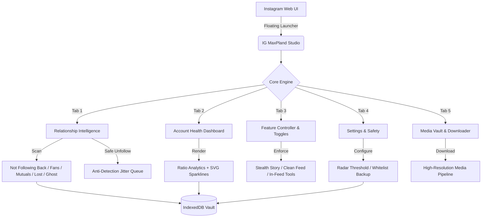
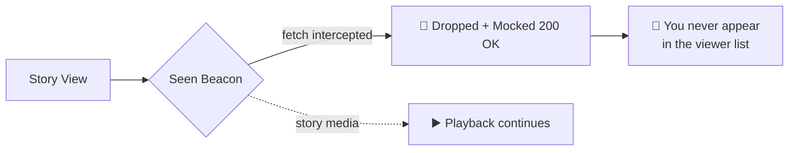
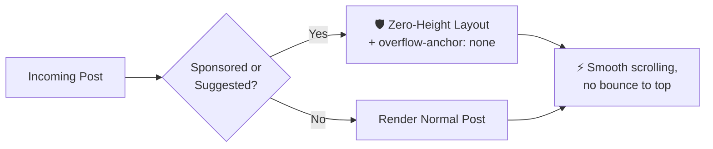
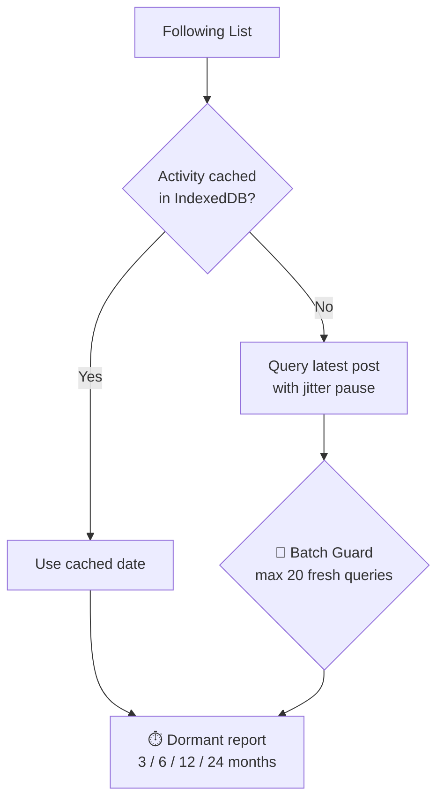
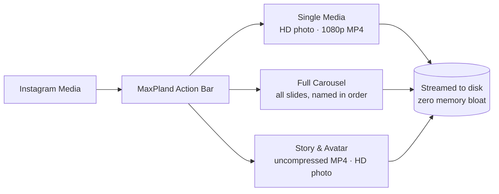

<div align="center">

# ⚡ IG MaxPland <sub>v2.6.0</sub>

**Relationship Intelligence Suite & Precision Media Downloader for Instagram Web**

*Raw speed · Zero-footprint privacy · Stealth anti-detection*
*Pure Vanilla JavaScript · Zero Dependencies · One File*

[](#-one-click-installation)
[](../../releases)
[](LICENSE)


</div>

---

## 🌟 Why IG MaxPland

Most Instagram browser extensions inject intrusive popups, harvest your session tokens to remote servers, or spam rapid queries that trigger account checkpoints and rate limits.

IG MaxPland is built on five strict engineering principles:

| # | Principle | What it means |
| :---: | :--- | :--- |
| 1 | 🛡️ **100% Client-Side Private** | Zero external servers, analytics, or tracking — everything runs inside your browser |
| 2 | 👁️ **Stealth Story Viewing** | Intercepts Instagram *seen* beacons at the network transport layer with native function masking |
| 3 | 🧹 **Clean Feed Mode** | Strips ads and suggestions with zero-height layout preservation and `overflow-anchor: none` — no scroll bounce |
| 4 | ⏱️ **Inactive Following Radar** | Finds dormant accounts (3 / 6 / 12 / 24 months) with safe batch limits (20 users/batch) |
| 5 | 📊 **Account Health Dashboard** | Mutual ratio, follower balance, and growth history with embedded SVG sparklines |

## ✨ Feature Overview

| Feature | Description |
| :--- | :--- |
| 👁️ **Stealth Story Viewer** | Watch stories anonymously — seen beacons are dropped before they leave your browser |
| 🧹 **Clean Feed Mode** | Zero ads, zero sponsored posts, zero scroll-jump layout collapse |
| ⏱️ **Inactive Following Radar** | Detects accounts dormant for 3–24 months with safe batching and instant resume |
| 📊 **Account Health Audit** | Real-time mutual ratios, ghost impact, and growth sparklines |
| 📥 **Precision Downloader** | HD photos, 1080p MP4 videos, full carousels, stories & avatars — streamed direct to disk |
| 🛡️ **Anti-Detection Hardening** | Native header parity, randomized jitter delays, zero bot signatures |

## 📊 Feature Comparison

| Capability | Generic Scrapers | Common IG Extensions | ⚡ **IG MaxPland** |
| :--- | :---: | :---: | :---: |
| **Privacy & Security** | ❌ Sends data to third parties | ⚠️ Requires full tab access | ✅ **100% Local (Zero Analytics)** |
| **Login Credential Safety** | ❌ Prompts for password | ⚠️ Session hijacking risk | ✅ **Zero Credentials Asked (Session Native)** |
| **Stealth Story Mode** | ❌ Not available | ⚠️ Leaks seen beacons | ✅ **Intercepted + Masked Function** |
| **Feed Clean Mode** | ❌ None | ⚠️ Freezes/crashes page | ✅ **Zero-Height Layout & No Scroll Bounce** |
| **Inactive Account Radar** | ❌ None | ❌ None | ✅ **Safe 20/batch Deep Post Timestamps** |
| **Account Health Analytics** | ❌ None | ⚠️ Cloud-based subscription | ✅ **Local Snapshot Diff & SVG Sparklines** |
| **Follower Tracking** | ❌ None | ⚠️ Shallow diffing | ✅ **IndexedDB Historical Snapshot Diff** |
| **Unfollow Protection** | ❌ None | ❌ None | ✅ **Protected Whitelist + JSON Backup** |
| **Unfollow Safety Pacing** | ❌ Rapid spam (ban risk) | ❌ Automated spamming | ✅ **4,500–7,500ms Randomized Jitter** |
| **Media Downloads** | ⚠️ Low-res or watermarked | ⚠️ Heavy memory-leaking ZIP | ✅ **Direct 1-Click Stream to Disk** |
| **External Dependencies** | ❌ Heavy (jQuery/Lodash) | ❌ Bloated runtime | ✅ **Zero (`@require` is unused)** |

## 🧩 Architecture



## 🛠️ Deep-Dive Feature Breakdown

<details open>
<summary><h3>👁️ 01 · Stealth Story Viewer</h3></summary>

> Watch any story without leaving a trace — seen telemetry is intercepted and dropped at the transport layer while playback stays seamless.



| Dimension | Implementation | Benefit |
| :--- | :--- | :--- |
| **Telemetry Interception** | Hooks `fetch` to drop `/api/v1/stories/reel/seen` requests | Zero seen receipts transmitted |
| **Native Anti-Detection** | `Function.prototype.toString` camouflage returns `[native code]` | Invisible to page-side hook scanners |
| **Window Hygiene** | State stored via `Symbol.for('mp_seen_hooked')` | Nothing exposed on `window` |
| **One-Click Control** | Floating `👁️ Stealth: ON / OFF` button on active stories | Toggle instantly mid-story |

</details>

<details open>
<summary><h3>🧹 02 · Clean Feed Mode</h3></summary>

> A clutter-free home feed with zero scroll jumping — strips sponsored and suggested content while preserving Instagram's React virtual DOM integrity.



| Engineering Pillar | Mechanism | User Impact |
| :--- | :--- | :--- |
| **Zero-Height Preservation** | `visibility: hidden; height: 0` instead of `display: none` | React fiber references stay intact — no DOM collapse |
| **Scroll-Anchor Lock** | `overflow-anchor: none !important` on filtered articles | Chromium's scroll engine never resets `scrollTop` to 0 |
| **Header-Targeted Scan** | Inspects only the `<header>` element (first 300 chars) | Fast filtering without re-rendering post trees |
| **Precise Keywords** | Only `sponsored`, `ได้รับการสนับสนุน`, `suggested for you`, `แนะนำสำหรับคุณ` | Normal posts from friends are never hidden |

</details>

<details open>
<summary><h3>⏱️ 03 · Inactive Following Radar</h3></summary>

> Prune abandoned accounts safely — detects profiles in your Following list that stopped posting months or years ago, with automatic rate-limit pacing and a resumable scan.



| Feature | Specification |
| :--- | :--- |
| **Inactivity Window** | 🎛️ Threshold: **90** (3 mo) / **180** (6 mo) / **365** (1 yr) / **730** (2 yr) days |
| **Batch Safety Ceiling** | 🛑 Max **20** fresh queries per batch to respect Meta rate limits |
| **Anti-Detection Jitter** | ⏱️ Randomized pauses of **3,500–6,000ms** between profile requests |
| **Instant Resume** | ⏭️ Stop anytime and continue exactly where the scan paused |
| **Persistent Cache** | 💾 Verified last-post timestamps saved locally — repeat scans run instantly |

</details>

<details open>
<summary><h3>📊 04 · Account Health Dashboard</h3></summary>

> Complete relationship intelligence at a single glance — computed 100% locally from historical snapshots.

| Metric | Diagnostic Meaning |
| :--- | :--- |
| **Follower / Following Ratio** | Classifies your account: ⭐ Creator · ⚖️ Healthy Balance · 🔍 Consumer Heavy |
| **Mutual Friendship Rate** | True relationship engagement (mutuals ÷ total following) |
| **Ghost Impact** | Accounts with **no profile picture** in your follower base |
| **Native SVG Sparkline** | Growth curve rendered on-the-fly — zero chart dependencies |

> [!NOTE]
> The growth sparkline and delta tracker are plotted from your own IndexedDB snapshots across scans — no external libraries, no network calls.

</details>

<details open>
<summary><h3>🔍 05 · Relationship Scanner & Safe Batch Unfollower</h3></summary>

> Deep categorization and a human-mimicking unfollow queue — keep your network clean without account checkpoint flags.

| Category | Description | Safety Action |
| :--- | :--- | :---: |
| **Not Following Back** | Accounts you follow that don't follow you back | Batch Unfollow |
| **Fans** | Accounts following you that you don't follow back | View / Whitelist |
| **Mutuals** | Reciprocal friends | Protected by default |
| **Recently Lost** | Unfollowers detected by snapshot diffing | Alerts + History |
| **Ghost Accounts** | Followers with no profile picture | Safe Cleanup |
| **Inactive Radar** | Accounts dormant beyond your threshold | One-Click Selection |

> [!TIP]
> **🛡️ Defensive Unfollow Safeguards**
> - **Starred Whitelist** — mark friends or creators with ⭐ to permanently lock them from any unfollow path (single, batch, and keyboard)
> - **JSON Backup / Restore** — export your Whitelist to migrate between devices
> - **Randomized 4.5–7.5s Jitter** — human-like pacing with live countdown and instant abort
> - **Verified Results Only** — an unfollow counts only when Instagram confirms it; ambiguous responses stop the queue instead of guessing

</details>

<details open>
<summary><h3>📥 06 · Precision Media Downloader & Vault</h3></summary>

> Original quality without compromise — direct-to-disk streaming for photos, 1080p MP4 videos, full carousels, and stories.



| Target | Capability |
| :--- | :--- |
| **In-Feed Action Menu** | Dark menu injected next to the bookmark button on every feed post |
| **1-Click Rapid Download** | Double-click the download icon to grab the active media at max resolution |
| **Full Carousel Batching** | Downloads every slide with proper sequential naming and per-media history keys |
| **Story Toolbar** | Floating bar on stories — full video, cover art, or open in new tab |
| **HD Profile Avatar** | Dedicated badge on profile pages for the full uncompressed photo |
| **Local Media Vault** | IndexedDB record of every download with re-download and inspect links |

</details>

---

## 💻 One-Click Installation

**Step 1 — Install a userscript manager:**
[**Tampermonkey**](https://www.tampermonkey.net/) *(recommended)* or [**Violentmonkey**](https://violentmonkey.github.io/)

**Step 2 — Choose your language build:**

| Edition | Language | Direct Installation |
| :--- | :--- | :--- |
| 🌐 **Global Release** | English | [**👉 Install IG MaxPland (v2.6.0 EN)**](https://raw.githubusercontent.com/Stxyu-p/ig-maxpland/main/ig_maxpland_en.user.js) |
| 🇹🇭 **Thai Native Edition** | ภาษาไทย | [**👉 ติดตั้ง IG MaxPland (v2.6.0 TH)**](https://raw.githubusercontent.com/Stxyu-p/ig-maxpland/main/ig_maxpland.user.js) |

**Step 3 — Start using:**
Open [Instagram Web](https://www.instagram.com/) and look for the **MaxPland floating icon** at the bottom-right of your screen.

## ⌨️ Shortcuts & Hotkeys

| Trigger | Action | Description |
| :--- | :--- | :--- |
| <kbd>Alt</kbd> + <kbd>Shift</kbd> + <kbd>M</kbd> | **Toggle Studio** | Open or close the MaxPland Control Center |
| **Floating Circle** | **Click / Drag** | Click to open Studio, drag to reposition |
| **Double-Click Download** | **Direct Download** | Instantly downloads the active in-feed media |
| **Single-Click Download** | **Precision Menu** | Options: HD image/video, all carousel slides, open in tab |
| **Story Stealth Button** | **Toggle Stealth** | Toggle anonymous story viewing on the story screen |

## 🔒 Security Manifesto

> [!IMPORTANT]
> **No Credentials Stored. No Analytics. Zero External Network Requests.**

1. **Native Session Transport** — never asks for your password; authenticates through your existing browser session cookies only
2. **Meta Header Parity** — legitimate web headers (`X-ASBD-ID`, dynamic `X-IG-WWW-Claim`), no obsolete bot signatures like `X-Requested-With`
3. **Local IndexedDB Database** — snapshots, whitelist, and activity cache stay on your machine in `IG_MAXPLAND_VAULT`
4. **Zero `@require` CDNs** — no third-party script vulnerabilities; everything lives in one self-contained file

## 🧪 Development & Testing

```bash
node --check ig_maxpland.user.js   # syntax gate
node round1.check.cjs              # 25 behavioral checks (no live Instagram access)
```

The check harness loads the real userscript in an isolated Node `vm` context with stubbed DOM, storage, and network boundaries — it exercises the original functions without ever sending a request to Instagram.

## ❓ FAQ

<details>
<summary><b>How does Stealth Story Viewer keep me anonymous?</b></summary>
<br>
When you view a story, the browser sends a "seen" beacon to Meta's servers. IG MaxPland intercepts and drops these requests before they leave your browser and returns a mocked 200 OK so playback is uninterrupted — your name never appears on the viewer list.
</details>

<details>
<summary><b>Why does Clean Feed Mode not jump back to the top?</b></summary>
<br>
Standard ad blockers use <code>display: none</code>, which collapses elements and disrupts Chromium's scroll-anchoring. IG MaxPland uses zero-height layout preservation plus <code>overflow-anchor: none !important</code>, keeping your exact viewport position.
</details>

<details>
<summary><b>What are the safe limits for bulk unfollowing?</b></summary>
<br>
We recommend 50–100 accounts per session with several hours between batches. IG MaxPland enforces a randomized <b>4.5–7.5 second</b> human-mimicking pause between each request, shows a live countdown, and stops immediately on checkpoint or auth errors.
</details>

<details>
<summary><b>Can I transfer my Starred Whitelist between devices?</b></summary>
<br>
Yes — open the <b>Settings</b> tab in MaxPland Studio, click <b>Backup Whitelist</b> to download a JSON file, then <b>Restore Whitelist</b> on the other device.
</details>

---

## 📄 License

MIT — see [LICENSE](LICENSE).

```
Copyright (c) 2026 P Choke & SORA
```

Feel free to star ⭐ the repository, report issues, and suggest enhancements!
