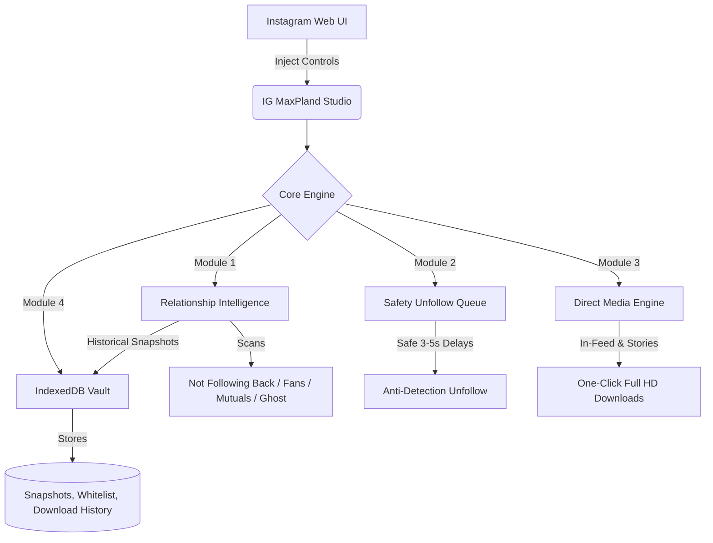

<div align="center">

  <h1>⚡ IG MaxPland</h1>
  <p><strong>The Precision Relationship Scanner & Full-Resolution Media Downloader for Instagram Web</strong></p>
  <p><em>Engineered for speed, privacy, and safety. Pure Vanilla JavaScript · Zero External Dependencies.</em></p>

  <p>
    <a href="#-installation"></a>
    <a href="https://github.com/Stxyu-p/ig-maxpland/releases"></a>
    <a href="LICENSE"></a>
  </p>

  <p>
    
    
    
    
  </p>

</div>

---

## 🌟 Why IG MaxPland?

Most Instagram downloaders or follower trackers are bloated, inject ads, send your session tokens to unknown remote servers, or rely on clunky third-party APIs that trigger immediate Instagram rate limits and account checkpoint verifications.

**IG MaxPland is built completely different:**
- 🛡️ **100% Client-Side**: Runs exclusively in your browser context. Zero external backend servers. Zero telemetry.
- ⚡ **Direct Native Requests**: Communicates directly through Instagram's internal Web REST gateway utilizing your active browser session (`ds_user_id` + `csrftoken`).
- 🛑 **Paranoid Anti-Detection Engine**: Randomized exponential backoffs, safety page limits, and an automated 3–5 second human-mimicking pause during bulk unfollow operations.
- 🗄️ **Persistent Local Vault**: Built on browser IndexedDB to preserve follower history snapshots and media download history without cloud storage.

---

## 📊 Feature Comparison

| Feature | Generic Web Scrapers | Typical IG Chrome Extensions | ⚡ **IG MaxPland** |
| :--- | :---: | :---: | :---: |
| **Privacy & Security** | ❌ Sends data to third parties | ⚠️ Requires full tab access / ads | ✅ **100% Local (Zero Analytics)** |
| **Login Security** | ❌ Asks for password | ⚠️ Session hijacking risk | ✅ **Uses Existing Session Cookies** |
| **Follower Tracking** | ❌ None | ⚠️ Shallow diffing | ✅ **Snapshot History & Lost Follower Diff** |
| **Unfollow Protection** | ❌ None | ❌ None | ✅ **Whitelist + JSON Backup/Restore** |
| **Bulk Unfollow Safety** | ❌ Rapid (Triggers ban) | ❌ Rapid spam | ✅ **3–5s Randomized Safe Jitter** |
| **Carousel Download** | ⚠️ Low-res or manual | ⚠️ Heavy ZIP compression | ✅ **Direct High-Speed HD Batching** |
| **Avatar Grabber** | ❌ None | ⚠️ Low-res thumbnail | ✅ **Direct Uncompressed HD Badge** |
| **External Dependencies** | ❌ Heavy (jQuery/Cloud APIs) | ❌ Bloated runtime | ✅ **Zero (`@require` is unused)** |

---

## 🚀 Key Modules & Architecture



### 1. 🔍 Relationship Intelligence & Scanner
* **Not Following Back**: Instantly detects users who don't follow you back.
* **Fans**: Lists your loyal followers whom you aren't currently following.
* **Mutual Connections**: View your reciprocal network.
* **Lost Follower Detection**: Compares your current follower list against local IndexedDB snapshots to pinpoint exactly who unfollowed you since your last check.
* **Ghost Account Radar**: Identifies suspicious bot accounts (default avatar, inactive numerical handles).
* **Advanced Filters**: Toggle on-the-fly to hide Verified users, Private accounts, Whitelisted accounts, or No-Avatar accounts.
* **Exporting**: Export datasets directly to **CSV**, **JSON**, or copy all active usernames to your clipboard.

### 2. 🛡️ Whitelist & Safety Vault
* **Protected VIPs**: Mark close friends, family, and key partners with a Star to ensure they can never be unfollowed by mistake.
* **JSON Backup & Restore**: Download your whitelist configuration as a standalone JSON file and restore it across browsers or computers with zero friction.

### 3. ⏱️ Automated Safe Unfollow Queue
* **Human-Mimicking Jitter**: Applies dynamic randomized delays (3 to 5 seconds per request) to prevent Instagram rate-limiting flags.
* **Live Queue Telemetry**: Live progress bar, remaining counts, success/failure tally, and real-time pause timers.
* **Instant Abort**: Stop the queue immediately at any time with a dedicated cancel button.

### 4. 📥 Precision HD Media Downloader
* **In-Feed Native Integration**: Seamlessly injected next to Instagram's bookmark/save button with a sleek dark-glass dropdown menu.
* **Dynamic Stream Detection**: Intelligently identifies single photos (`.jpg`) vs progressive video streams (`.mp4`) at original upload resolution.
* **Full Carousel Batching**: Download every slide in a multi-image/video post directly to your device with one click.
* **1-Click Rapid Download**: Double-click the download button on any post to trigger an instant download without opening the menu.
* **Story & Highlights Bar**: Floating bottom toolbar on active Instagram Stories for downloading raw video/photos, thumbnails, or opening media streams directly in a new tab.
* **HD Avatar Badge**: Injected badge on profile headers to fetch and download uncompressed, full-resolution profile pictures.

---

## 💻 Installation

### Step 1: Install a Userscript Manager
Ensure you have one of the following browser extensions installed:
* [**Tampermonkey**](https://www.tampermonkey.net/) *(Highly Recommended)*
* [**Violentmonkey**](https://violentmonkey.github.io/)

### Step 2: One-Click Script Install
Choose your preferred language build:

| Language | Target Edition | Direct Install Link |
| :--- | :--- | :--- |
| 🌐 **English** | Public Release (Recommended) | [**Click to Install (v2.5.0)**](https://raw.githubusercontent.com/Stxyu-p/ig-maxpland/main/ig_maxpland_en.user.js) |
| 🇹🇭 **ภาษาไทย** | Thai Native Version | [**Click to Install (v2.4.9)**](https://raw.githubusercontent.com/Stxyu-p/ig-maxpland/main/ig_maxpland.user.js) |

### Step 3: Launch
Open [instagram.com](https://www.instagram.com/) and look for the glowing **MaxPland circle icon** at the bottom-right of your screen!

---

## ⌨️ Shortcuts & Cheat Sheet

| Trigger / Action | Behavior |
| :--- | :--- |
| <kbd>Alt</kbd> + <kbd>Shift</kbd> + <kbd>M</kbd> | Toggle the MaxPland Studio control center |
| **Floating Circle** *(Bottom-right)* | Click to open Studio, or click and drag anywhere on screen |
| **Double-Click** *(Feed Download Button)* | Instant one-click direct download of currently viewed media |
| **Single-Click** *(Feed Download Button)* | Open precision download menu (HD Photo/Video, All Carousel, Open in Tab) |

---

## 🔒 Security & Privacy Manifesto

> [!IMPORTANT]
> **Zero Analytics. Zero Telemetry. Zero Remote Servers.**

1. **Session Transparency**: IG MaxPland never prompts for your password. It operates solely through the session cookie (`ds_user_id`) provided by your browser when you log into Instagram.
2. **Local Storage Guarantee**: Your relationship history, whitelist data, and download logs are saved strictly in your browser's private **IndexedDB database** (`IG_MAXPLAND_VAULT`).
3. **No External Scripts**: Many userscripts include external scripts via `@require` which can be modified maliciously upstream. IG MaxPland contains **ZERO `@require` dependencies**—all logic is strictly contained inside the single userscript file.

---

## ❓ Frequently Asked Questions (FAQ)

<details>
<summary><b>Q: Will using IG MaxPland get my Instagram account banned?</b></summary>
<br>
IG MaxPland is engineered with strict defensive safety limits:
- It limits pagination per scan to conservative boundaries.
- The bulk unfollower includes a mandatory 3–5 second randomized delay between requests.
- It immediately pauses and alerts you if Instagram returns HTTP 429 (Rate Limit) or a Checkpoint challenge.
However, we always recommend moderating unfollow actions to under 100–150 accounts per day to respect Meta's automated thresholds.
</details>

<details>
<summary><b>Q: How does the Lost Follower detection work?</b></summary>
<br>
Every time you run a scan, IG MaxPland saves a snapshot of your follower ID list into IndexedDB. On future scans, it diffs your historical snapshots with your live list to show exactly which accounts unfollowed you since your last check.
</details>

<details>
<summary><b>Q: Why does the script download files directly instead of packaging a ZIP?</b></summary>
<br>
Generating ZIP archives inside client-side browser memory causes massive RAM spikes, freezes tabs on large carousels, and wastes CPU cycles. Using native <code>GM_download</code> streams each high-definition file directly to your disk instantly without browser lag.
</details>

---

## 📄 License

This project is licensed under the **MIT License** - see the [LICENSE](LICENSE) file for details.

```
Copyright (c) 2026 P Choke & SORA
```
Feel free to fork, customize, and contribute!
